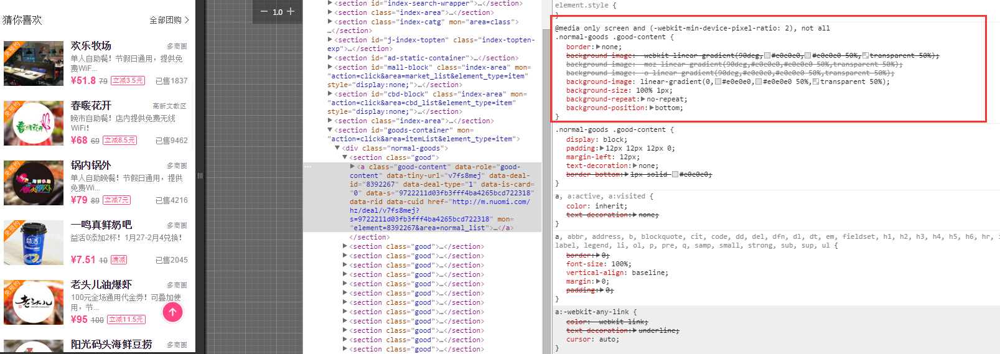
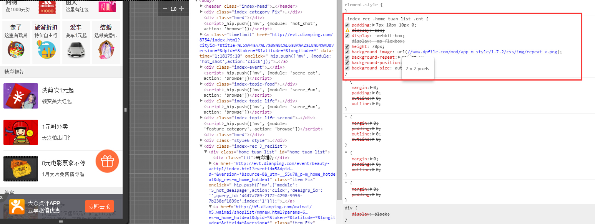
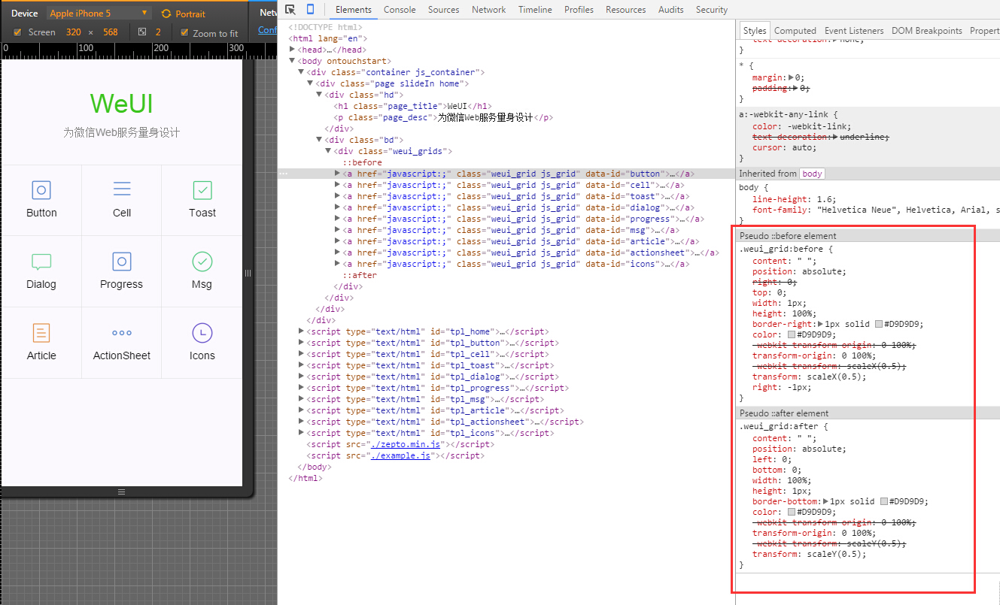
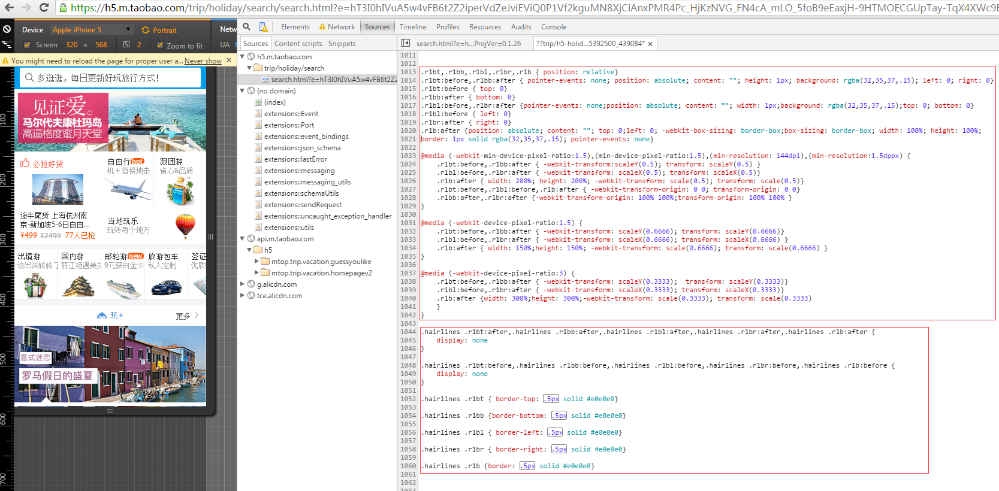

mobile web retina 下 1px边框解决方案
==================================

## Retina屏的移动设备如何实现真正的1px的线？

在retina屏下面，如果你写了这样的meta `<meta name="viewport" content="initial-scale=1, maximum-scale=1, minimum-scale=1, user-scalable=no"> `

你将永远无法写出1px宽度的东西，除此之外，inline的SVG等元素，也会按照逻辑像素来渲染，整个页面的清晰度会打折；

## 先看看“诸子百家”是如何实现的

### 百度糯米

```css

@media only screen and (-webkit-min-device-pixel-ratio:2),only screen and (min-device-pixel-ratio:2) {
	.normal-goods .good-content {
		border: none;
		background-image: -webkit-linear-gradient(90deg,#e0e0e0,#e0e0e0 50%,transparent 50%);
		background-image: -moz-linear-gradient(90deg,#e0e0e0,#e0e0e0 50%,transparent 50%);
		background-image: -o-linear-gradient(90deg,#e0e0e0,#e0e0e0 50%,transparent 50%);
		background-image: linear-gradient(0,#e0e0e0,#e0e0e0 50%,transparent 50%);
		background-size: 100% 1px;
		background-repeat: no-repeat;
		background-position: bottom
	}
}

```



### 大众点评

```css

.index-rec .home-tuan-list .cnt {
    padding: 7px 10px 10px 0;
    display: box;
    display: -webkit-box;
    display: -ms-flexbox;
    height: 78px;
    background-image: url(//www.dpfile.com/mod/app-m-style/1.7.2/css/img/repeat-x.png);
    background-repeat: repeat-x;
    background-position: 0 bottom;
    background-size: auto 1px
}

```



### 微信WeUI

```css

.weui_grid:before {
    content: " ";
    position: absolute;
    right: 0;
    top: 0;
    width: 1px;
    height: 100%;
    border-right: 1px solid #D9D9D9;
    color: #D9D9D9;
    -webkit-transform-origin: 0 100%;
    transform-origin: 0 100%;
    -webkit-transform: scaleX(0.5);
    transform: scaleX(0.5);
    right: -1px;
}
 
.weui_grid:after {
    content: " ";
    position: absolute;
    left: 0;
    bottom: 0;
    width: 100%;
    height: 1px;
    border-bottom: 1px solid #D9D9D9;
    color: #D9D9D9;
    -webkit-transform-origin: 0 100%;
    transform-origin: 0 100%;
    -webkit-transform: scaleY(0.5);
    transform: scaleY(0.5);
}

```



### 阿里去哪，利用hairlines挂到<html class="hairlines">上 ios8以上支持 0.5px

```js

<script>
    if (/iP(hone|od|ad)/.test(navigator.userAgent)) {  //  就是放到html根节点上的   ios8现在普及率高了，可以省略
        var v = (navigator.appVersion).match(/OS (\d+)_(\d+)_?(\d+)?/), version = parseInt(
                v[1], 10);
        if (version >= 8) {
            document.documentElement.classList.add('hairlines')
        }
    };
</script>

```

```css

.r1bt {
    border-top: 1px solid rgba(32,35,37,.15)
}
 
.r1bb {
    border-bottom: 1px solid rgba(32,35,37,.15)
}
 
.r1bl {
    border-left: 1px solid rgba(32,35,37,.15)
}
 
.r1br {
    border-right: 1px solid rgba(32,35,37,.15)
}
 
.r1b {
    border: 1px solid rgba(32,35,37,.15)
}
 
.hairlines .r1bt,.hairlines .r1bb,.hairlines .r1bl,.hairlines .r1br,.hairlines .r1b {
    border-width: .5px!important
}

```



### 阿里去哪 另一种 `transform:scale(x)`缩放，兼容性实用性非常好 推荐使用

```css

/*retina 1px border start*/
.retinabt,.retinabb,.retinabl,.retinabr,.retinab { position: relative;}
.retinabt:before,.retinabb:after {pointer-events: none;position: absolute;content: ""; height: 1px; background: rgba(32,35,37,.24);left: 0;right: 0}
.retinabt:before {top: 0}
.retinabb:after {bottom: 0}
.retinabl:before,.retinabr:after {pointer-events: none;position: absolute;content: ""; width: 1px; background: rgba(32,35,37,.24); top: 0; bottom: 0}
.retinabl:before {left: 0}
.retinabr:after {right: 0}
.retinab:after {position: absolute;content: "";top: 0;left: 0; -webkit-box-sizing: border-box; box-sizing: border-box; width: 100%; height: 100%; border: 1px solid rgba(32,35,37,.24); pointer-events: none}
 
@media (-webkit-min-device-pixel-ratio:1.5),(min-device-pixel-ratio:1.5),(min-resolution: 144dpi),(min-resolution:1.5dppx) {
.retinabt:before,.retinabb:after {-webkit-transform:scaleY(.5);transform: scaleY(.5) }
.retinabl:before,.retinabr:after {-webkit-transform: scaleX(.5); transform: scaleX(.5) }
.retinab:after { width: 200%; height: 200%;-webkit-transform: scale(.5); transform: scale(.5) }
.retinabt:before,.retinabl:before,.retinab:after {-webkit-transform-origin: 0 0;transform-origin: 0 0}
.retinabb:after,.retinabr:after { -webkit-transform-origin: 100% 100%;transform-origin: 100% 100%}
}
 
@media (-webkit-device-pixel-ratio:1.5) {
.retinabt:before,.retinabb:after { -webkit-transform: scaleY(.6666); transform: scaleY(.6666) }
.retinabl:before,.retinabr:after {-webkit-transform: scaleX(.6666); transform: scaleX(.6666)}
.retinab:after {width: 150%; height: 150%;-webkit-transform: scale(.6666); transform: scale(.6666) }
}
 
@media (-webkit-device-pixel-ratio:3) {
.retinabt:before,.retinabb:after { -webkit-transform: scaleY(.3333); transform: scaleY(.3333)}
.retinabl:before,.retinabr:after { -webkit-transform: scaleX(.3333); transform: scaleX(.3333)}
.retinab:after {width: 300%;height: 300%; -webkit-transform: scale(.3333);transform: scale(.3333)}
}

```


### H5  Canvas  Retina屏幕处理的1px的函数

```js

/**
 * HiDPI Canvas Polyfill (1.0.9)
 *
 * Author: Jonathan D. Johnson (http://jondavidjohn.com)
 * Homepage: https://github.com/jondavidjohn/hidpi-canvas-polyfill
 * Issue Tracker: https://github.com/jondavidjohn/hidpi-canvas-polyfill/issues
 * License: Apache 2.0
*/
;(function(prototype) {
 
    var pixelRatio = (function(context) {
            var backingStore = context.backingStorePixelRatio ||
                        context.webkitBackingStorePixelRatio ||
                        context.mozBackingStorePixelRatio ||
                        context.msBackingStorePixelRatio ||
                        context.oBackingStorePixelRatio ||
                        context.backingStorePixelRatio || 1;
 
            return (window.devicePixelRatio || 1) / backingStore;
        })(prototype),
 
        forEach = function(obj, func) {
            for (var p in obj) {
                if (obj.hasOwnProperty(p)) {
                    func(obj[p], p);
                }
            }
        },
 
        ratioArgs = {
            'fillRect': 'all',
            'clearRect': 'all',
            'strokeRect': 'all',
            'moveTo': 'all',
            'lineTo': 'all',
            'arc': [0,1,2],
            'arcTo': 'all',
            'bezierCurveTo': 'all',
            'isPointinPath': 'all',
            'isPointinStroke': 'all',
            'quadraticCurveTo': 'all',
            'rect': 'all',
            'translate': 'all',
            'createRadialGradient': 'all',
            'createLinearGradient': 'all'
        };
 
    if (pixelRatio === 1) return;
 
    forEach(ratioArgs, function(value, key) {
        prototype[key] = (function(_super) {
            return function() {
                var i, len,
                    args = Array.prototype.slice.call(arguments);
 
                if (value === 'all') {
                    args = args.map(function(a) {
                        return a * pixelRatio;
                    });
                }
                else if (Array.isArray(value)) {
                    for (i = 0, len = value.length; i < len; i++) {
                        args[value[i]] *= pixelRatio;
                    }
                }
 
                return _super.apply(this, args);
            };
        })(prototype[key]);
    });
 
     // Stroke lineWidth adjustment
    prototype.stroke = (function(_super) {
        return function() {
            this.lineWidth *= pixelRatio;
            _super.apply(this, arguments);
            this.lineWidth /= pixelRatio;
        };
    })(prototype.stroke);
 
    // Text
    //
    prototype.fillText = (function(_super) {
        return function() {
            var args = Array.prototype.slice.call(arguments);
 
            args[1] *= pixelRatio; // x
            args[2] *= pixelRatio; // y
 
            this.font = this.font.replace(
                /(\d+)(px|em|rem|pt)/g,
                function(w, m, u) {
                    return (m * pixelRatio) + u;
                }
            );
 
            _super.apply(this, args);
 
            this.font = this.font.replace(
                /(\d+)(px|em|rem|pt)/g,
                function(w, m, u) {
                    return (m / pixelRatio) + u;
                }
            );
        };
    })(prototype.fillText);
 
    prototype.strokeText = (function(_super) {
        return function() {
            var args = Array.prototype.slice.call(arguments);
 
            args[1] *= pixelRatio; // x
            args[2] *= pixelRatio; // y
 
            this.font = this.font.replace(
                /(\d+)(px|em|rem|pt)/g,
                function(w, m, u) {
                    return (m * pixelRatio) + u;
                }
            );
 
            _super.apply(this, args);
 
            this.font = this.font.replace(
                /(\d+)(px|em|rem|pt)/g,
                function(w, m, u) {
                    return (m / pixelRatio) + u;
                }
            );
        };
    })(prototype.strokeText);
})(CanvasRenderingContext2D.prototype);
;(function(prototype) {
    prototype.getContext = (function(_super) {
        return function(type) {
            var backingStore, ratio,
                context = _super.call(this, type);
 
            if (type === '2d') {
 
                backingStore = context.backingStorePixelRatio ||
                            context.webkitBackingStorePixelRatio ||
                            context.mozBackingStorePixelRatio ||
                            context.msBackingStorePixelRatio ||
                            context.oBackingStorePixelRatio ||
                            context.backingStorePixelRatio || 1;
 
                ratio = (window.devicePixelRatio || 1) / backingStore;
 
                if (ratio > 1) {
                    this.style.height = this.height + 'px';
                    this.style.width = this.width + 'px';
                    this.width *= ratio;
                    this.height *= ratio;
                }
            }
 
            return context;
        };
    })(prototype.getContext);
})(HTMLCanvasElement.prototype);

```


